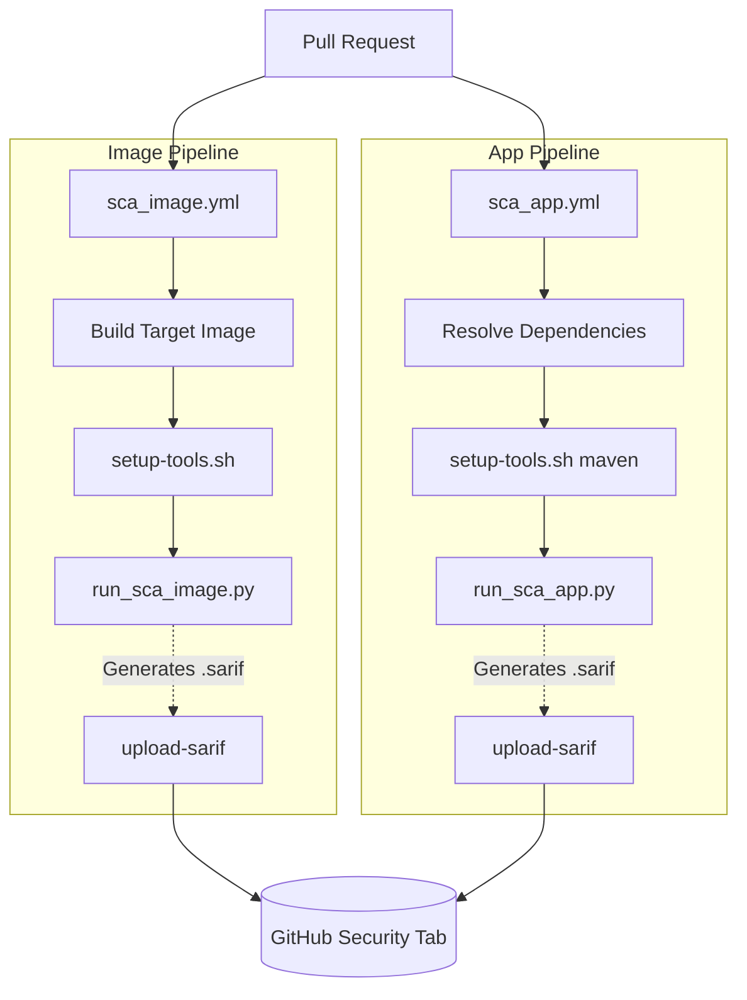
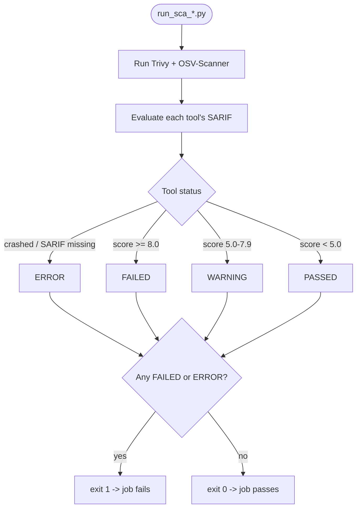

# Software Composition Analysis (SCA) Pipeline

Automated dependency and container vulnerability scanning for `platform-ui`, enforced during the Continuous Integration (CI) to block known vulnerabilities (CVEs) before merge automatically on Pull Requests.

The pipeline executes a dual-layer scanning strategy using **Trivy** and **OSV-Scanner**:

- **Application Scanning**: Analyzes source code dependencies and lockfiles via generated Software Bill of Materials (SBOMs).

- **Infrastructure Scanning**: Analyzes OS-level packages and layers within the built Docker containers.

## Table of Contents

- [1. Repository layout](#1-repository-layout)
- [2. Architecture](#2-architecture)
- [3. How one pipeline run works](#3-how-one-pipeline-run-works)
- [4. Tool installation & SBOM generation (`setup-tools.sh`)](#4-tool-installation--sbom-generation-setup-toolssh)
- [5. Suppressing a false positive](#5-suppressing-a-false-positive)
- [6. Exit codes: how "vulnerabilities found" is told apart from "tool broke"](#6-exit-codes-how-vulnerabilities-found-is-told-apart-from-tool-broke)
- [7. Installing dependencies: `npm ci` vs `npm install`](#7-installing-dependencies-npm-ci-vs-npm-install)
- [8. Running it locally](#8-running-it-locally)
- [9. Environment variables](#9-environment-variables)

## 1. Repository layout

```
.github/
├── workflows/
│   ├── sca_image.yml         # builds the image, runs the image-scan pipeline
│   └── sca_app.yml           # generates an SBOM, runs the SBOM-scan pipeline
└── scripts/
    ├── setup-tools.sh        # installs trivy + osv-scanner,generates SBOM
    ├── run_sca_image.py      # orchestrator for the image pipeline
    ├── run_sca_app.py        # orchestrator for the app/SBOM pipeline
    ├── parse_sarif.py        # Reads SARIF security-severity scores of vulnerabilities.
    ├── suppress_trivy.yaml   # Trivy ignore file
    └── suppress_osv_scanner.toml  # OSV-Scanner ignore file
```

## 2. Architecture



> **Note:** both workflows trigger on `pull_request` only and run independently in parallel. Within each workflow, Trivy and OSV-Scanner findings are aggregated into that workflow's own pass/warn/fail gate.

---


## 3. How one pipeline run works

`run_sca_image.py` and `run_sca_app.py` are structurally identical , only the Trivy/OSV-Scanner subcommands. The logic below applies to both.



### Gate status reference

| Status | Meaning | Blocks the pipeline? |
|---|---|---|
| `PASSED` | Highest `security-severity` score finding is below 5.0 | No |
| `WARNING` | Highest finding is 5.0–7.9 | No (logged only) |
| `FAILED` | Highest finding is ≥ 8.0 | **Yes** |
| `ERROR` | Unexpected failure occurred during execution| **Yes** |

`parse_sarif.evaluate()` reads the CVSS score of each individual vulnerability from the SARIF's `security-severity` property, then takes the highest one across all results in that file. That single number decides `PASSED`, `WARNING`, or `FAILED` for the tool.

---
## 4. Tool installation & SBOM generation (`setup-tools.sh`)

```bash
bash .github/scripts/setup-tools.sh [maven|npm|none]
```

1. Installs Trivy (`TRIVY_VERSION`, default `v0.71.1`) via the official install script.
2. Installs OSV-Scanner (`OSV_SCANNER_VERSION`, default `v2.4.0`) as a standalone binary from GitHub Releases.
3. Based on the positional argument, optionally generates an SBOM:
   - `maven` → `mvn org.cyclonedx:cyclonedx-maven-plugin:makeAggregateBom -q` (writes `target/bom.json`)
   - `npm` → `npx --yes @cyclonedx/cyclonedx-npm --output-file target/bom.json`
   - `none` → skipped (used by `sca_image.yml`, which scans the image directly and doesn't need an SBOM)

The script runs with `set -euo pipefail` plus an `ERR` trap, so it stops and prints the failing line/command on any error rather than continuing silently.

## 5. Suppressing a false positive

If it's a false positive or an accepted-risk finding, add it to the relevant ignore file below so it stops blocking the gate. 
For example, to ignore a specific vulnerability:

**Trivy** (`suppress_trivy.yaml`):
```yaml
vulnerabilities:
  - id: CVE-2026-54515
    statement: "The proposed fix version 2.21.5 not yet released"
```

**OSV-Scanner** (`suppress_osv_scanner.toml`):
```toml
[[IgnoredVulns]]
id = "GHSA-5jmj-h7xm-6q6v" # or CVE-2026-54515 ,GO-2022-0968 ...
ignoreUntil = 2026-09-30
reason = "The proposed fix version 2.21.5 not yet released"
```

Refer to the official documentation for complete suppression options:

- **Trivy**: [Filtering and ignore files](https://trivy.dev/docs/latest/configuration/filtering/#trivyignoreyaml)
- **OSV-Scanner**: [Ignore vulnerabilities by ID](https://google.github.io/osv-scanner/configuration/#ignore-vulnerabilities-by-id)


---

## 6. Exit codes: how "vulnerabilities found" is told apart from "tool broke"

**Trivy** exits `0` by default regardless of findings. Since these scripts don't change this, any non-zero exit code means the scan itself failed (e.g., bad image reference, Docker problems, or malformed SBOM).

**OSV-Scanner** uses its exit code to report scan results, per its own docs:

| Exit code | Meaning |
|---|---|
| `0` | Scan completed, no known vulnerabilities |
| `1` | Scan completed, vulnerabilities **were** found |
| `1–126` | Reserved for other vulnerability-result-related outcomes |
| `127` | General error |
| `128` | No packages found (scan format didn't pick up any files) |
| `129–255` | Reserved for non-result errors |

`run_osv_scanner()` in both orchestrators normalizes exit code `1` to `0`, since finding vulnerabilities isn't a tool failure, the real pass/warn/fail decision comes later from the SARIF scores. Any other non-zero code (127, 128, etc.) is flagged `ERROR`.

---

## 7. Installing dependencies: `npm ci` vs `npm install`

The SBOM generator (`@cyclonedx/cyclonedx-npm`) reads `package-lock.json` to determine exact dependency versions. That lockfile is only trustworthy if it's actually in sync with `package.json`, otherwise the SBOM describes a dependency tree that may not match what actually gets installed.

Use `npm ci`, not `npm install`, before generating the SBOM:

- **`npm ci`** installs strictly from `package-lock.json`, deletes `node_modules` first for a clean install, and **fails immediately** if `package.json` and `package-lock.json` are out of sync. It's built for CI: fast, deterministic, and it never rewrites the lockfile.
- **`npm install`** will update `package-lock.json` to resolve any mismatch with `package.json`. Fine on a dev machine, but in CI it means the lockfile that got committed and reviewed isn't necessarily the one that gets scanned.

If `npm ci` fails, that's a signal `package-lock.json` is stale and needs to be regenerated locally (`npm install`, then commit the updated lockfile), not something to patch around in the pipeline.

---

## 8. Running it locally

**Image pipeline**
```bash
bash .github/scripts/setup-tools.sh            # installs trivy + osv-scanner
docker build -t platform-ui:local .
python .github/scripts/run_sca_image.py
```

**App pipeline**

> **Note:** `npm ci` installs strictly from `package-lock.json` and fails immediately if it's out of sync with `package.json`, that failure means the lockfile is stale and needs to be regenerated (`npm install`, to updated lockfile).

```bash
npm ci
bash .github/scripts/setup-tools.sh npm    # installs tools + generates target/bom.json
python .github/scripts/run_sca_app.py
```

All output paths and ignore-file locations are overridable via environment variables (see next section).

---
## 9. Environment variables
| Variable | `run_sca_image.py` Default | `run_sca_app.py` Default | Purpose |
|---|---|---|---|
| `IMAGE_NAME` | `platform-ui:local` | — | Image reference to scan |
| `SBOM_PATH` | — | `target/bom.json` | SBOM to scan |
| `TRIVY_IGNOREFILE` | `suppress_trivy.yaml` | `suppress_trivy.yaml` | Trivy suppression file |
| `OSV_IGNOREFILE` | `suppress_osv_scanner.toml` | `suppress_osv_scanner.toml` | OSV-Scanner suppression file |
| `TRIVY_SARIF_OUTPUT` | `trivy-image.sarif` | `trivy-app.sarif` | Trivy output path |
| `OSV_SARIF_OUTPUT` | `osv-scanner-image.sarif` | `osv-scanner-app.sarif` | OSV-Scanner output path |
| `MERGED_SARIF_OUTPUT` | `merged-SCA-platform-ui-image.sarif` | `merged-SCA-platform-ui-app.sarif` | Combined artifact path |


Each script hardcodes a default value for every variable via `os.getenv("VAR", "default")`. 
The workflow's `env:` block sets the actual env var, which overrides that default at runtime. 
the Python default only applies if no env var is set at all (e.g. running the script locally without one).

For example `sca_image.yml`:
```yaml
env:
  IMAGE_NAME: platform-ui:testing
  TRIVY_IGNOREFILE: .github/scripts/suppress_trivy.yaml
  ...
```