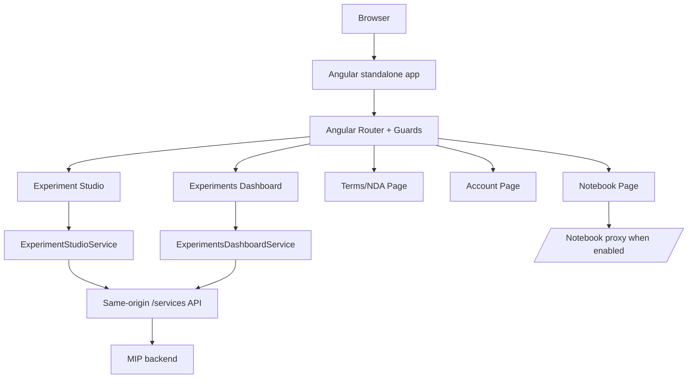

# Architecture

## App Type
This repository is a single Angular 21 standalone frontend application named `fl-platform`. It is the Platform UI for the Medical Informatics Platform (MIP), used to compose experiments, configure algorithms, access optional notebooks, and review/export results from a backend available under `/services`.

## High-Level Structure

## UI Flow
- Default route redirects to `/experiments-dashboard`.
- Main routes are `/experiments-dashboard`, `/experiment-studio`, `/account`, `/terms`, and optional `/notebook`.
- Most routes use `AuthGuard` and `TermsGuard`; `/terms` uses `AuthGuard`; `/notebook` is additionally gated by a runtime `NOTEBOOK_ENABLED` match check.
- The app shell lives in `app.component.*` and wraps pages with shared header/footer components.

## Data and API Flow
- API calls use relative `/services/...` URLs so local proxy and nginx deployment routing remain consistent.
- `src/proxy.conf.json` proxies `/services` to `http://localhost:8080` and `/notebook/` to `http://localhost:8000` during local development.
- `auth.interceptor.ts` adds `withCredentials` for same-origin API calls.
- `app.config.ts` configures `HttpClient` with the credentials interceptor and XSRF cookie/header names.
- Main backend endpoints visible in the frontend:
  - `GET /services/activeUser`
  - `POST /services/activeUser/agreeNDA`
  - `GET /services/data-models`
  - `GET /services/algorithms`
  - `GET /services/experiments`
  - `GET /services/experiments/:id`
  - `POST /services/experiments`
  - `POST /services/experiments/transient`
  - `PATCH /services/experiments/:id`
  - `DELETE /services/experiments/:id`

## Authentication and Terms
- `AuthService` checks the current session with `GET /services/activeUser`.
- Login redirects to `/services/oauth2/authorization/keycloak?frontend_redirect=...`.
- Logout hard-redirects to `/services/logout`.
- Auth redirect state is stored in localStorage with `redirect_url`.
- `TermsGuard` routes users to `/terms` when `user.agreeNDA` is false.
- `TermsService` stores the intended terms destination in localStorage with `tos_redirect_url`.
- The terms page loads `src/assets/tos.md` and posts acceptance to `/services/activeUser/agreeNDA`.

## Module Boundaries
- Page components own feature presentation and local UI state.
- Services under `src/app/services` own cross-component state, backend calls, orchestration, and persistence to browser storage.
- Models under `src/app/models` define backend/frontend DTOs and interfaces.
- Core mapping and constants live under `src/app/core`.
- Visualization registries and renderers live under `src/app/pages/experiment-studio/visualisations`.
- Shared app chrome and generic helpers live under `src/app/pages/shared`.

## State Management
- The app uses Angular Signals heavily for feature state.
- `ExperimentStudioService` is the main orchestration layer for selected data models, datasets, variables, covariates, filters, algorithm configuration, run/polling flows, transient preview calls, edit hydration, and sessionStorage persistence.
- `ExperimentsDashboardService` owns paged experiment list state, filtering, sharing, renaming, deletion, and result fetches.
- `ErrorService` shares global feature errors through a `BehaviorSubject`.

## Visualization and Export
- Algorithm result table rendering is driven by `AlgorithmTableRegistry`.
- Chart rendering is driven by `AlgorithmChartRegistry` and renderer files under `visualisations/charts/renderers`.
- Backend algorithm definitions are mapped in `src/app/core/algorithm-mappers.ts`.
- Result labels and enum mappings are handled by `ExperimentLabelService` and `algorithm-result-enum-mapper`.
- PDF exports are split between experiment result export and distribution/descriptive statistics export services.

## Runtime and Deployment
- The Dockerfile builds with Node 20 and serves the Angular output with nginx.
- `docker-entrypoint.sh` writes `/usr/share/nginx/html/assets/env.js` from runtime environment variables.
- Runtime env values include backend proxy context/server, MIP version, notebook settings, and guided tutorial defaults.
- `nginx.conf.template` proxies `/${PLATFORM_BACKEND_CONTEXT}/` to the backend and `/${JUPYTER_CONTEXT}/` to Jupyter only when notebook support is enabled.

## Known Gaps
- No dedicated lint, format, or standalone typecheck scripts are defined.
- No e2e test runner is configured in this repository.
- Many authenticated experiment flows require a running backend and Keycloak-compatible environment for full validation.
- CI workflows publish/mirror images, but no workflow in this repo currently runs unit tests or builds on pull requests.
